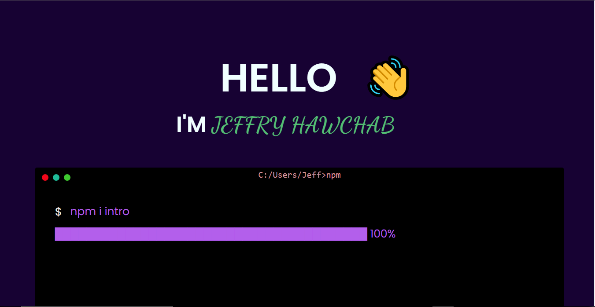

<h2 align="center">
  Portfolio Website  
  <a href="https:"https://jeffhawchab.netlify.app/" target="_blank">jeffryhawchab</a>
</h2>

  

 

 &nbsp;
 &nbsp;
 &nbsp;

You can fork this repo to modify and make changes of your own. Please give me proper credit  Thanks!

## Built With

My personal portfolio <a href="https://jeffryhawchab.netlify.app" target="_blank">https://jeffryhawchab.netlify.app</a> which features some of my github projects as well  my  technical skills. 

This project was built using these technologies.

- Html5
- javascript
- Jquey
- CSS3

## Features

**📱 Fully Responsive**

## Getting Started

Clone down this repository and start editing.

## Usage Instructions

Open the project navigate to index.html and open it with live server extension  

### Show your support

Give a ⭐ if you like this website!
